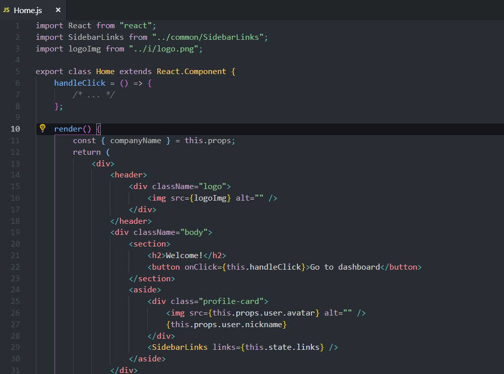

This simple extension provides JSX refactor code actions for React developers.

## Features

-   Extract JSX code parts to a new class or functionnal component
-   Supports TypeScript and TSX
-   Works with classes, functions and arrow functions
-   Handles key attribute and function bindings
-   Compatible with React Hooks API

## Preview

## 1.1.0 Update

-   Added `Extract to Class Component` Code action
-   Added option to config Custom Babel plugins used by parser
-   Added option to choose generated function type
-   Added error message on parse error
-   Updated @babel modules to the latest version
-   Removed `Extract to File` Code action for now (due to VSCode changes), workaround is to call manually `Move to new file` on the newly created Component
-   Updated vscode to the latest and migrated extension to webpack

## Help to debug

### Code Action doesn't appear when select JSX code

If something doesn't work don't panic. Probably you use a language feature that is not recognized by the parser within your module (file). Now you get back an error message about what's going on. Use the new Babel plugins setting to configure it for your needs. See: https://babeljs.io/docs/en/babel-parser#plugins.

If no luck please open an issue with
-   smallest non-working code snippet to reproduce the issue
-   the received error message

### Refactoring happens but results broken code

Please record an issue with the original code and the result after refactor executed.